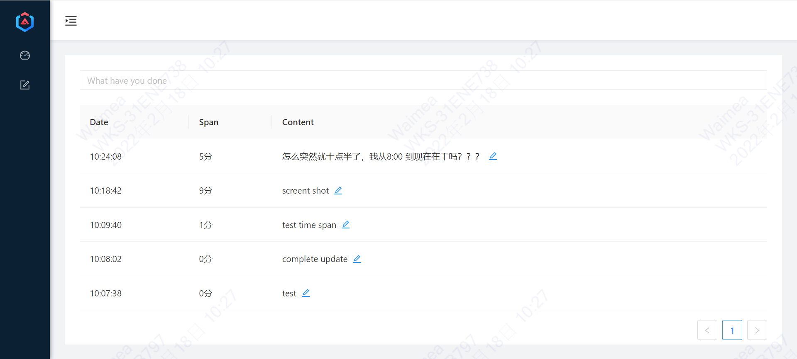

# 使用 github pages 和 issues 构建的事件计时小项目

用来管理每件事浪费了多少时间

## 项目展示

## 如何使用

### 一、创建自己的 repository

名称一定要是 `db`

可见性: private(别人看不到) 或者 public

### 二、生成自己的 access token

[github access token 生成网址](https://github.com/settings/tokens)

1. 点击 generate
2. 选择范围为 repo
3. 记住这个 access token

### 三、现在就可以登录了

username: 自己的 github 名称

password: 刚才生成的 Access Token

## Todo

- [x] 登录使用 github 认证
- [ ] 可以编辑每一行的 span
- [ ]

This project was generated with [Angular CLI](https://github.com/angular/angular-cli) version 13.1.4.

## Development server

Run `ng serve` for a dev server. Navigate to `http://localhost:4200/`. The app will automatically reload if you change any of the source files.

## Code scaffolding

Run `ng generate component component-name` to generate a new component. You can also use `ng generate directive|pipe|service|class|guard|interface|enum|module`.

## Build

Run `ng build` to build the project. The build artifacts will be stored in the `dist/` directory.

## Running unit tests

Run `ng test` to execute the unit tests via [Karma](https://karma-runner.github.io).

## Running end-to-end tests

Run `ng e2e` to execute the end-to-end tests via a platform of your choice. To use this command, you need to first add a package that implements end-to-end testing capabilities.

## Further help

To get more help on the Angular CLI use `ng help` or go check out the [Angular CLI Overview and Command Reference](https://angular.io/cli) page.
